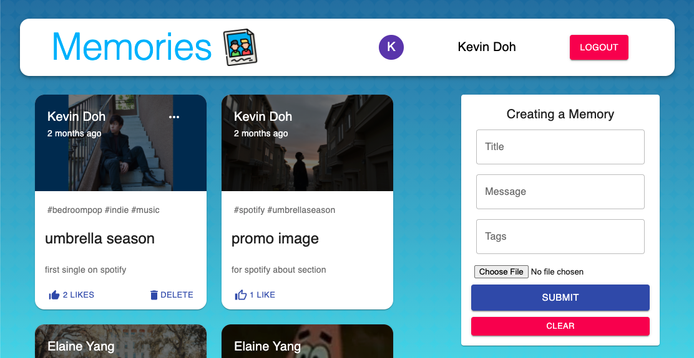

# Photo Blog 

The Memories photo blog is a responsive web application that allows users to sign in and post images with captions, hashtags, and titles. Users can also like posts and edit their own if they wish. This application includes user authentication, third-party APIs, and database models. This project was guided by JSM.

## Overview and Technologies

This is a MERN Stack application (MongoDB, Express, React, Node.js). Authentication is implemented using JSON web tokens and Bcryptjs. 

Mongoose and MongoDB Atlas are used to create User and Post models which make up the majority of the website interaction. Redux is used in tandem to provide state management on the front-end.

The application's styling is done primarily with Material UI.
    
## Screenshots

   
## Deployed Application

  * https://photo-blog-jsm.herokuapp.com/
  
## License 

Copyright (c) 2021 Kevin Doh

Permission is hereby granted, free of charge, to any person obtaining a copy
of this software and associated documentation files (the "Software"), to deal
in the Software without restriction, including without limitation the rights
to use, copy, modify, merge, publish, distribute, sublicense, and/or sell
copies of the Software, and to permit persons to whom the Software is
furnished to do so, subject to the following conditions:

The above copyright notice and this permission notice shall be included in all
copies or substantial portions of the Software.

THE SOFTWARE IS PROVIDED "AS IS", WITHOUT WARRANTY OF ANY KIND, EXPRESS OR
IMPLIED, INCLUDING BUT NOT LIMITED TO THE WARRANTIES OF MERCHANTABILITY,
FITNESS FOR A PARTICULAR PURPOSE AND NONINFRINGEMENT. IN NO EVENT SHALL THE
AUTHORS OR COPYRIGHT HOLDERS BE LIABLE FOR ANY CLAIM, DAMAGES OR OTHER
LIABILITY, WHETHER IN AN ACTION OF CONTRACT, TORT OR OTHERWISE, ARISING FROM,
OUT OF OR IN CONNECTION WITH THE SOFTWARE OR THE USE OR OTHER DEALINGS IN THE
SOFTWARE.